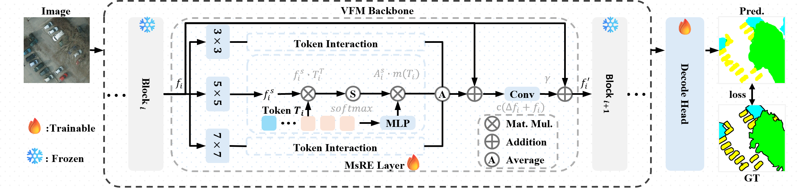

<h2 style="border-bottom: 1px solid lightgray;">
MsRE: Towards Efficient Remote Sensing Segmentation via Vision Foundation Models
</h2>

   
    
    
    
    
    
     
    
    
    
    

 

 Network Overview 

### 🔍️🔍️ NEWS

- [2026/04/13] ✨✨ Init Repo.

[//]: # (- [2025/11/17] ✨✨ The [arxiv] paper will coming soon.)
